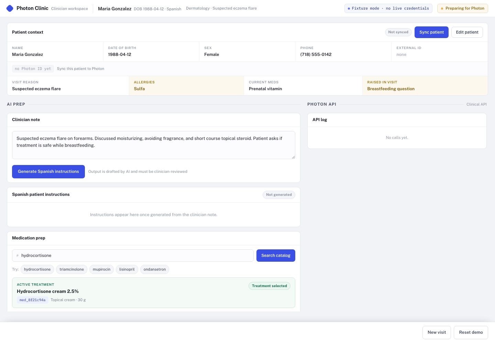
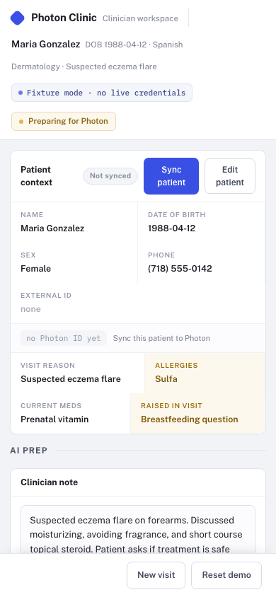

# Photon Health Case Study

A clinician workspace for syncing Photon patient/treatment context and generating reviewed Spanish patient instructions.

## Run Locally

Install dependencies:

```sh
npm install
```

Start the app in fixture/demo mode:

```sh
cp .env.example .env.local
npm run dev
```

Open the local URL printed by `vinext dev`, usually `http://localhost:3000`.

To run real OpenAI and Photon calls locally, fill these values in `.env.local`:

```sh
OPENAI_API_KEY=
OPENAI_MODEL=gpt-4.1-mini

PHOTON_CLIENT_ID=
PHOTON_CLIENT_SECRET=
PHOTON_AUTH_TOKEN=
```

For local Cloudflare Worker-style testing:

```sh
cp .dev.vars.example .dev.vars
npm run build
npm run start
```

Smoke test a local or deployed URL:

```sh
SMOKE_BASE_URL=http://localhost:3000 npm run test:smoke
SMOKE_BASE_URL=http://localhost:3000 LIVE_SMOKE=1 npm run test:smoke
```

## Live Deploy

Deployed app: https://photon-clinic.jimyyang-cf.workers.dev

### Desktop



### Mobile



## Scripts

- `npm run dev` starts the vinext dev server.
- `npm run build` builds the Cloudflare Worker output.
- `npm run start` starts the built Worker locally with Wrangler.
- `npm run deploy` deploys the Cloudflare Worker.
- `npm run test:smoke` runs deployed API smoke tests.

## Prototype Controls

The V2 visit workspace includes a dark prototype state switcher for demo and QA only. It is visible
in development. To include it in a production preview build for an interview demo, set:

```sh
VITE_SHOW_PROTOTYPE_CONTROLS=true
```

## Live API seams

The app renders in fixture mode when OpenAI or Photon credentials are not configured. Fixture mode is labeled in the
header and uses the same route boundaries as live mode.

Set local values in an ignored `.env.local` file or Cloudflare Worker secrets:

```sh
OPENAI_API_KEY=
OPENAI_MODEL=gpt-4.1-mini
PHOTON_CLIENT_ID=
PHOTON_CLIENT_SECRET=
PHOTON_TOKEN_URL=https://auth.neutron.health/oauth/token
PHOTON_AUDIENCE=https://api.neutron.health
PHOTON_API_URL=https://api.neutron.health/graphql
PHOTON_CATALOG_API_URL=https://clinical-api.neutron.health/graphql
PHOTON_AUTH_TOKEN=
```

Wrangler already defines the non-secret API defaults in `wrangler.jsonc`. Add the secret values through
interactive prompts before deploying:

```sh
npx wrangler secret put OPENAI_API_KEY
npx wrangler secret put PHOTON_CLIENT_ID
npx wrangler secret put PHOTON_CLIENT_SECRET
npx wrangler secret put PHOTON_AUTH_TOKEN
```

For local Worker testing after `npm run build`, copy `.dev.vars.example` to `.dev.vars` and fill the same four
secret values before running `npm run start`.

The MVP syncs patient and treatment context only. It does not create prescriptions or request prescribing scope.

## Deployed smoke tests

Run API and browser UI smoke tests against a deployed Worker:

```sh
SMOKE_BASE_URL=https://photon-clinic.jimyyang-cf.workers.dev npm run test:smoke
```

The live patient sync and browser UI smoke create Photon sandbox patient records and are skipped by
default. Run them explicitly:

```sh
SMOKE_BASE_URL=https://photon-clinic.jimyyang-cf.workers.dev LIVE_SMOKE=1 npm run test:smoke
```
